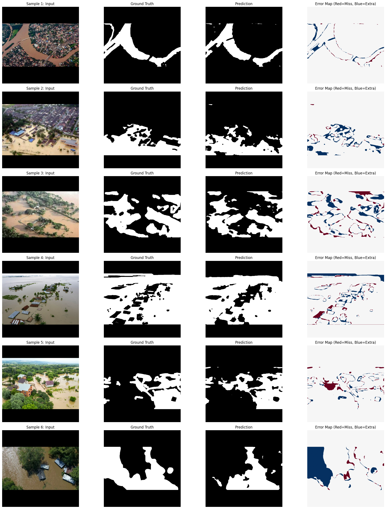
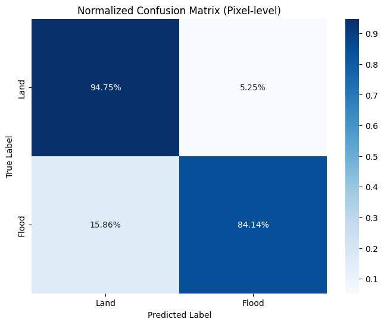
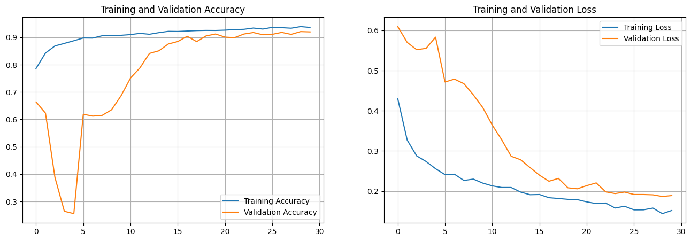

# Mini Project VIII - Image Segmentation
BCIT Master of Science - Applied Computing : COMP 9130 - Applied Artificial Intelligence Mini Project 8

## Problem Description

    The goad of this project it so create a semantic segmentation model to identify the flood regeions.

    Being able to to measure and quantify the extent of the flood is critical for disaster management, becasue it assessing the scale of damage quickly and helps to allocate resources effectively.

## Dataset 
    Dataset: (https://www.kaggle.com/datasets/faizalkarim/flood-area-segmentation)
        Image: Folder containing all the flood images.
        Mask: Folder containing all the mask images.
        metadata.csv: A csv file mapping the image name with its mask.

## Sample prediction visualizations

## Results Summary with Key Metrics (mIoU, per-class IoU table)

## Setup instructions
    Clone the repository:
        git clone <repository-url>
    Upload the .ipynb files to Google Colab.
    Select the GPU runtime.
    Run the cells in order.

--------------- OR ---------------

    Using VS Code with Google Colab

    https://developers.googleblog.com/google-colab-is-coming-to-vs-code/

    1. Install the Colab Extension
        In VS Code, open the Extensions view from the Activity Bar on the left (or press [Ctrl|Cmd]+Shift+X).
        Search the marketplace for Google Colab.
        Click Install on the official Colab extension.
        (If prompted, install the required extension dependency - Jupyter)

    2. Connect to a Colab Runtime
        Create or open any .ipynb notebook file in your local workspace.
        Either run a cell (which drops you into kernel selection) or click the Select Kernel button in the top right.
        Click Colab and then select T4 GPU runtime, sign in with your Google account
    3. Run the cells in order.

## Team Member Contributions
Group 10

Bryan: Analysis Requirements

Jun: Technical Requirements

Together: Learning Hub Report